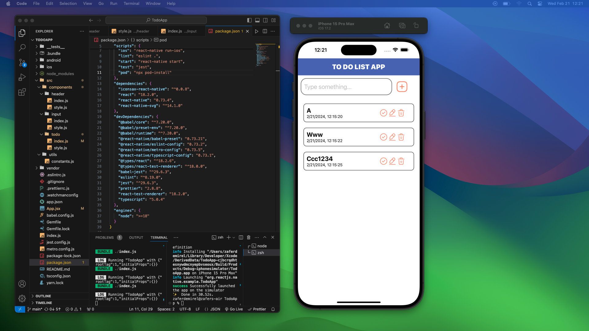

# To Do App

React-Native ile geliştirilmiş basit bir to do app örneği.
Bu uygulama ile istediğin kadar yapmayı planladığın işi listeye tarih ve saatleriyle birlikte ekleyebilirsin.
Eklediğin bu işleri silebilir, düzenleyebilir ve tamamlandı olarak işaretleyebilirsin. 
 
 
With this application, you can add as many jobs as you want to the list with dates and times. 
You can delete, edit and mark these jobs as completed.
 

- Developed a simple to do app with React-Native.
- It was created using with useState and AsyncStorage.
- Used iconsax library for icons.

## Find the screenshot below

